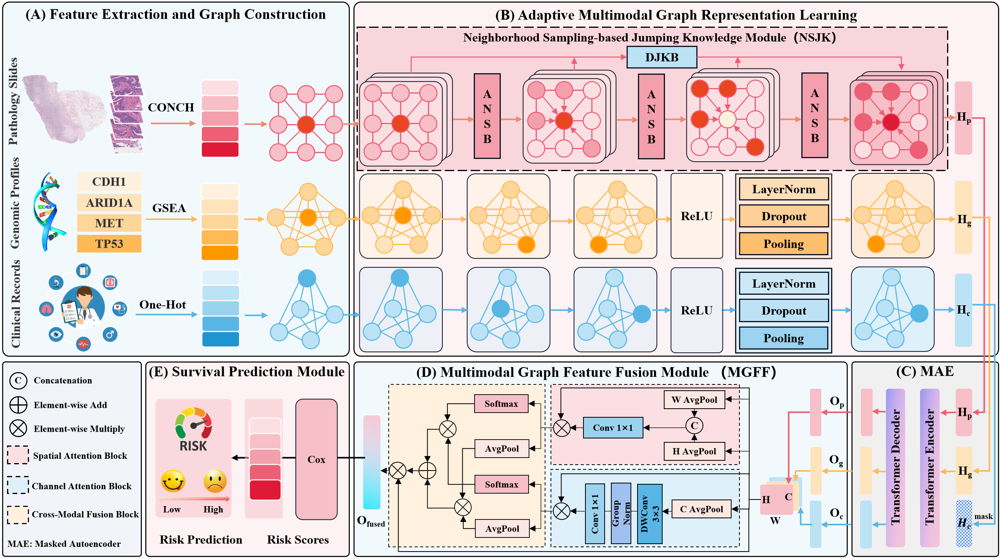

# AMGL
Accurate prediction of cancer survival is essential for personalized treatment planning and clinical decision-making. However, existing multimodal approaches often struggle to model long-range dependencies in pathology slides and to balance the contribution of heterogeneous modalities effectively. To address these challenges, we propose an Adaptive Multimodal Graph Learning Framework with Dynamic Neighborhood Sampling (AMGL), which effectively integrates pathology slides, genomic profiles, and clinical records for cancer survival prediction. Specifically, we first extract features from each modality and construct graphs separately. Then, we introduce a Neighborhood Sampling-based Jumping Knowledge (NSJK) module. It captures key node information and long-range dependencies in pathology slide graphs by adaptively sampling neighborhoods, dynamically adjusting the receptive field to emphasize informative neighbors, and learning to fuse multilevel representations across graph layers via dynamic jumping knowledge. Finally, a Multimodal Graph Feature Fusion (MGFF) module is designed to incorporate heterogeneous modality features using spatial and channel attention blocks together with a cross-modal fusion block. Experiments on six TCGA cancer datasets demonstrate that AMGL achieves a 3.6\% average improvement in C-index compared to the state-of-the-art method. These results confirm the effectiveness and robustness of AMGL for multimodal cancer survival prediction.
<div align="center">
  
</div>

## Framework Overview
AMGL integrates heterogeneous patient modalities through **four major modules**:

1. **Feature Extraction and Graph Construction**  
   - Constructs three modality-specific graphs:
     - 🩺 Pathology graph using **CONCH** feature extractor  
     - 🧬 Genomic graph built via **Gene Set Enrichment Analysis (GSEA)**  
     - 🧾 Clinical graph based on structured patient variables  

2. **Adaptive Multimodal Graph Representation Learning**  
   - Employs **Adaptive Neighborhood Sampling Block (ANSB)** and  
     **Dynamic Jumping Knowledge Block (DJKB)** for long-range dependencies.

3. **Multimodal Graph Feature Fusion (MGFF)**  
   - Fuses spatial and channel attention blocks with a cross-modal fusion unit.

4. **Cox-based Survival Prediction Module**  
   - Predicts risk scores and stratifies patients into high- and low-risk groups.

     
## Data Acquisition

All datasets are publicly accessible:

- 🧬 Pathology slides & Genomic & clinical data: [GDC Portal](https://portal.gdc.cancer.gov/)

Each patient sample includes:
- Whole Slide Images (WSIs)
- Clinical records
- Genomic profiles

## Data Partitioning

We use **5-fold cross-validation** across all TCGA datasets.  
Splitting ensures patient-level separation and balanced survival outcomes for each fold.

## Training

Train the AMGL model using:

```bash
python train.py
```


## Acknowledgment
We thank the contributors of  
[**HGCN**](https://github.com/tixilingbi/HGCN) and [**CONCH**](https://github.com/mahmoodlab/CONCH)  
for their foundational contributions to multimodal cancer survival research.


